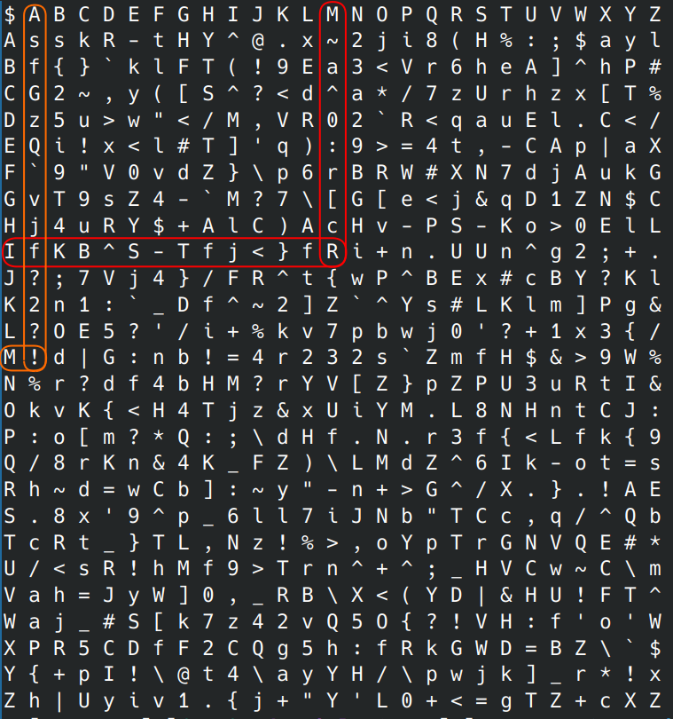

# PasswordGenerator
Just a simple password generator I created in Python for practice.

## Usage
```bash
$ .\password_generator.py -h
usage: password_generator.py [-h] [--alpha] [--upper] [--symbol] [--number] [--length LENGTH] [--count COUNT] [--grid]

options:
  -h, --help            show this help message and exit
  --alpha, -a           Include lowercase alpha characters
  --upper, -u           Enable capitalization
  --symbol, -s          Include symbols
  --number, -n          Include numbers
  --length LENGTH, -l LENGTH
                        Length of password to generate [Default=15]
  --count COUNT, -c COUNT
                        Number of passwords to generate [Default=1]
  --grid, -g            Generate password grid

Example:

password_generator.py -a -u -s -l 10
RoT^"nRD.J
```

1. Generate lowercase alpha passwords
    ```bash
    $ .\password_generator.py -a
    ojvidcpsqehiklo
    ```
2. Generate lowercase alpha passwords with numbers
    ```bash
    $ .\password_generator.py -a -n
    psg55li5c22h9le
    ```
3. Generate lowercase and uppercase alpha passwords with numbers and symbols
    ```bash
    $ .\password_generator.py -a -n -u -s
    ,X~gE&-AQ{_m,6H
    ```
4. Generate multiple passwords at once
    ```bash
    $ ./password_generator.py -a -n -c 10
    g8ga209mf6hfbqv
    jdcy1xkvvi54ywz
    u2r27uxbxivx79e
    gp9n1617lrf8e5b
    mssader1edww53z
    1404o2owdcqq0u0
    ji7ee459qxkalmu
    lvvqyl4wdqxhxyu
    mxq2fju45iovzi5
    71vksd52hkb4lfp
    ```

## Password Grid
Password grid is a way to never remember your passwords or store them in a database or cloud provider, but be able to always figure them out. You generate a password grid and keep a copy in your wallet or pocket and reference it whenever you need a password.

You can also place a copy in a safe or give a copy to a friend for safe keeping, so you never lose the ability to figure out your passwords. People won't be able to figure out your passwords unless you tell them how your pattern works.

### Usage
```
$ ./password_generator.py -g
$ A B C D E F G H I J K L M N O P Q R S T U V W X Y Z
A s s k R - t H Y ^ @ . x ~ 2 j i 8 ( H % : ; $ a y l 
B f { } ` k l F T ( ! 9 E a 3 < V r 6 h e A ] ^ h P # 
C G 2 ~ , y ( [ S ^ ? < d ^ a * / 7 z U r h z x [ T % 
D z 5 u > w " < / M , V R 0 2 ` R < q a u E l . C < / 
E Q i ! x < l # T ] ' q ) : 9 > = 4 t , - C A p | a X 
F ` 9 " V 0 v d Z } \ p 6 r B R W # X N 7 d j A u k G 
G v T 9 s Z 4 - ` M ? 7 \ [ G [ e < j & q D 1 Z N $ C 
H j 4 u R Y $ + A l C ) A c H v - P S - K o > 0 E l L 
I f K B ^ S - T f j < } f R i + n . U U n ^ g 2 ; + . 
J ? ; 7 V j 4 } / F R ^ t { w P ^ B E x # c B Y ? K l 
K 2 n 1 : ` _ D f ^ ~ 2 ] Z ` ^ Y s # L K l m ] P g & 
L ? O E 5 ? ' / i + % k v 7 p b w j 0 ' ? + 1 x 3 { / 
M ! d | G : n b ! = 4 r 2 3 2 s ` Z m f H $ & > 9 W % 
N % r ? d f 4 b H M ? r Y V [ Z } p Z P U 3 u R t I & 
O k v K { < H 4 T j z & x U i Y M . L 8 N H n t C J : 
P : o [ m ? * Q : ; \ d H f . N . r 3 f { < L f k { 9 
Q / 8 r K n & 4 K _ F Z ) \ L M d Z ^ 6 I k - o t = s 
R h ~ d = w C b ] : ~ y " - n + > G ^ / X . } . ! A E 
S . 8 x ' 9 ^ p _ 6 l l 7 i J N b " T C c , q / ^ Q b 
T c R t _ } T L , N z ! % > , o Y p T r G N V Q E # * 
U / < s R ! h M f 9 > T r n ^ + ^ ; _ H V C w ~ C \ m 
V a h = J y W ] 0 , _ R B \ X < ( Y D | & H U ! F T ^ 
W a j _ # S [ k 7 z 4 2 v Q 5 O { ? ! V H : f ' o ' W 
X P R 5 C D f F 2 C Q g 5 h : f R k G W D = B Z \ ` $ 
Y { + p I ! \ @ t 4 \ a y Y H / \ p w j k ] _ r * ! x 
Z h | U y i v 1 . { j + " Y ' L 0 + < = g T Z + c X Z
```

### Example Password
Let's say you need to create a password for Microsoft.com. Your password's pattern could be choosing the first and second letter of the domain name and combining all the characters.

So for Microsoft.com, your password could be: `~a^0:rcRfKB^S-Tfj<}fR`

Amazon.com would be: ```sfGzQ`vjf?2?!```

Or maybe you only take the first few characters from each row and column. Or the column going down, and the row going from right to left.

Microsoft.com would now be: `~a^0:rcRRf}<jfT-S^BKf`

That pattern is personal to you. If you need to rotate your passwords, you can just generate a new password grid, or change how you create/figure out your passwords.

